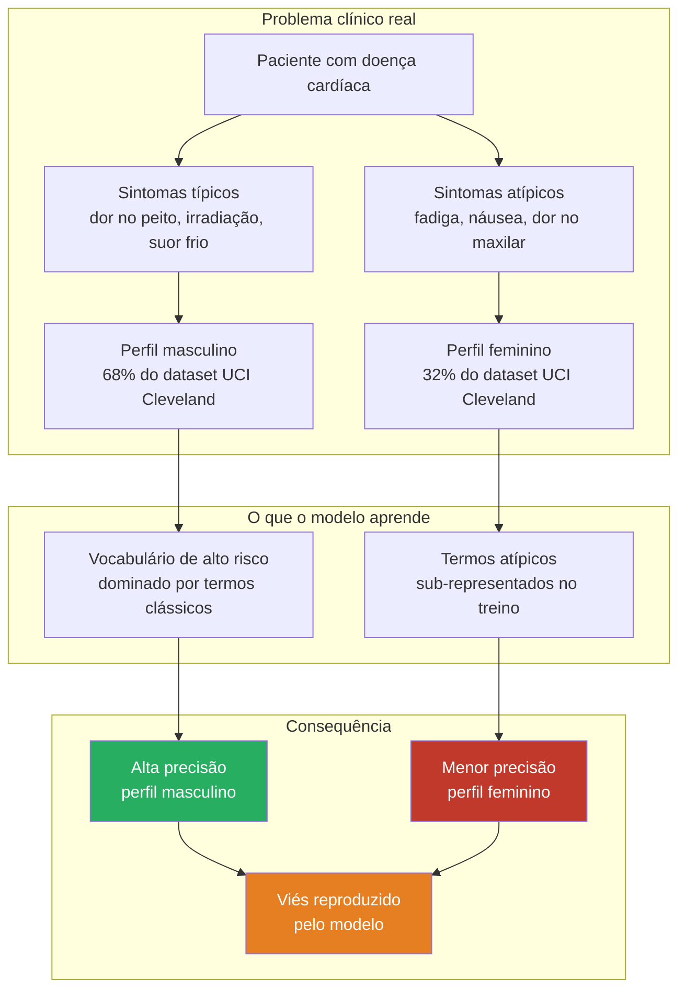
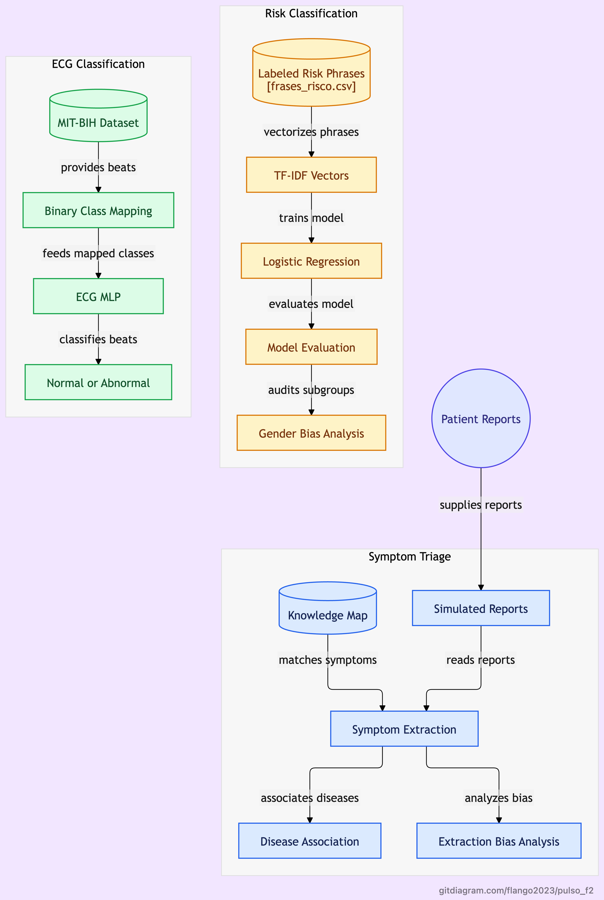
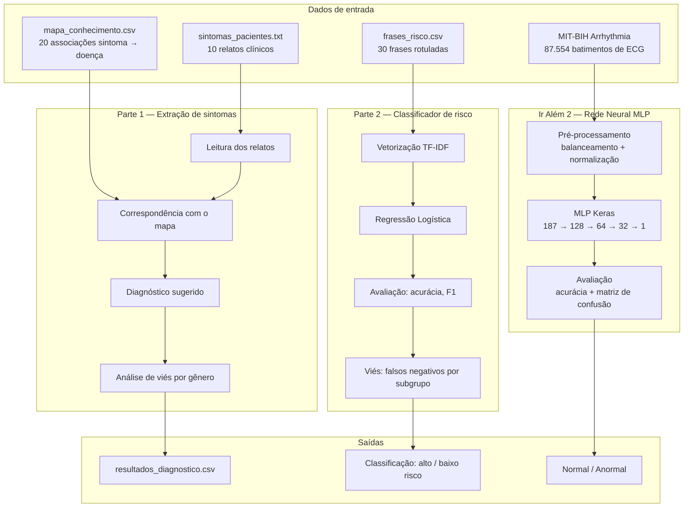
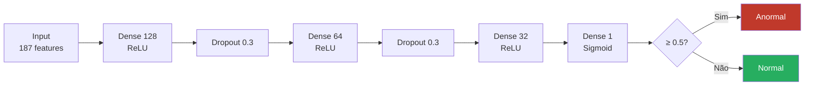

# FIAP — Faculdade de Informática e Administração Paulista

<p align="center">
  <a href="https://www.fiap.com.br/">
    
  </a>
</p>

<br>
<h2 align="center">Diagnóstico Automatizado: IA no Estetoscópio Digital</h2>

<p align="center">
  <strong>Aluno:</strong> Richard Schmitz &nbsp;|&nbsp; <strong>RM:</strong> 567951<br>
  <strong>Curso EAD:</strong> Inteligência Artificial - FIAP &nbsp;|&nbsp; <strong>Fase:</strong> 2  Pulso: Inteligência Cardiológica com Consciência de Dados
</p>

---

## Vídeo de demonstração

> **[Demonstração completa - Fase 2](https://youtu.be/JKBgJ1k_x5w)**
> Postado no YouTube como "não listado". Demonstra a extração de sintomas, o classificador de risco com TF-IDF e a rede neural MLP para classificação de ECG.

---

# Pulso Fase 2: Diagnóstico Automatizado

O Pulso simula o ecossistema de dados de uma plataforma de cardiologia inteligente. Ao longo de sete fases, o projeto integra Machine Learning, IoT, Visão Computacional, NLP e séries temporais aplicados à saúde cardiovascular.

Esta é a Fase 2: diagnóstico assistido por IA a partir de relatos textuais e sinais de ECG.

---

## Continuidade com a Fase 1

A Fase 2 constrói diretamente sobre o que foi estabelecido na Fase 1:

- Os dados numéricos do UCI Cleveland documentados na Fase 1 fundamentam as variáveis clínicas usadas no mapa de conhecimento desta fase
- O eixo de viés de gênero documentado no `governance.md` da Fase 1 é verificado empiricamente nesta fase: o classificador é avaliado separadamente para sintomas típicos masculinos e sintomas atípicos femininos
- Os textos sobre cardiologia coletados na Fase 1 serviram de base para a construção dos relatos clínicos simulados

Repositório da Fase 1: https://github.com/flango2023/Pulso

---

## Eixo temático

O Pulso foi construído em torno de uma questão clínica e de governança documentada na literatura médica:

**doenças cardíacas em mulheres são sistematicamente subdiagnosticadas porque os dados históricos que treinaram sistemas de triagem refletem uma população majoritariamente masculina.**

Na Fase 2, essa questão deixa de ser apenas documentada e passa a ser testada: o classificador de risco é avaliado por subgrupo de gênero para verificar se sintomas atípicos femininos são classificados com menor precisão do que sintomas típicos masculinos. Essa análise reproduz, em escala reduzida, o problema que sistemas reais de triagem clínica enfrentam.



Referências:
- Mosca L, et al. Sex/gender differences in cardiovascular disease prevention. Circulation. 2011;124(19):2145-54.
- Mehta LS, et al. Acute Myocardial Infarction in Women. Circulation. 2016;133(9):916-47.
- Arquivos Brasileiros de Cardiologia — artigos disponíveis no repositório da Fase 1

<p align="center">
  
</p>

---

## Pipeline da Fase 2



---

## Estrutura do repositório

```
Pulso_F2/
│
├── README.md
│
├── assets/
│   └── diagram.png                       ← Diagrama da arquitetura do projeto
│
├── data/
│   ├── sintomas_pacientes.txt            ← 10 relatos clínicos simulados
│   ├── mapa_conhecimento.csv             ← Associação sintomas → doenças
│   ├── frases_risco.csv                  ← Dataset rotulado para classificação
│   ├── resultados_diagnostico.csv        ← Saída do notebook Parte 1 (gerado em execução)
│   ├── batimentos_exemplo.png            ← Visualização de ECG normal vs. anormal
│   └── curvas_aprendizado.png            ← Curvas de treino da rede neural MLP
│
└── notebooks/
    ├── fase2_parte1_extracao.ipynb       ← Parte 1: extração de sintomas e diagnóstico
    ├── fase2_parte2_classificador.ipynb  ← Parte 2: TF-IDF + Regressão Logística
    └── fase2_iralém2_mlp_ecg.ipynb       ← Ir Além 2: rede neural MLP para ECG
```

---

## Parte 1: Relatos de pacientes e extração de sintomas

### Arquivos

| Arquivo | Descrição |
|---|---|
| `data/sintomas_pacientes.txt` | 10 relatos clínicos simulados. Frases 1–5 com sintomas típicos masculinos; frases 6–10 com sintomas atípicos femininos |
| `data/mapa_conhecimento.csv` | 20 associações entre sintomas e doenças cardiovasculares, com nível de risco e perfil predominante por gênero |
| `notebooks/fase2_parte1_extracao.ipynb` | Leitura dos relatos, identificação de sintomas por correspondência com o mapa e análise de viés de gênero na extração |

### Sobre os relatos

Os 10 relatos foram construídos com base nos textos científicos coletados na Fase 1 e nas variáveis clínicas do dataset UCI Cleveland. As frases 1–5 descrevem sintomas clássicos de doença cardiovascular — dor no peito, irradiação para o braço, suor frio — que correspondem ao perfil masculino típico documentado na literatura. As frases 6–10 descrevem sintomas atípicos — fadiga extrema, náusea, dor no maxilar, desconforto difuso — que correspondem ao perfil feminino documentado por Mosca et al. (2011) e Mehta et al. (2016).

Essa distinção é intencional: permite verificar se o sistema de extração baseado em regras identifica sintomas atípicos com a mesma eficácia que sintomas clássicos.

### Sobre o mapa de conhecimento

O arquivo `mapa_conhecimento.csv` contém 20 associações entre sintomas e doenças cardiovasculares. Cada linha registra três sintomas, a doença associada, o nível de risco e o perfil predominante na literatura clínica. A coluna de perfil predominante é a contribuição original desta fase: ela documenta explicitamente quais doenças têm apresentação clínica diferente por gênero, informação que sistemas de triagem tradicionais raramente registram de forma estruturada.

### Como executar no Google Colab

1. Abra `notebooks/fase2_parte1_extracao.ipynb` no Google Colab
2. Faça upload de `data/sintomas_pacientes.txt` e `data/mapa_conhecimento.csv`
3. Ajuste os caminhos na célula de configuração se necessário
4. Execute todas as células em ordem

---

## Parte 2: Classificador de risco com TF-IDF e Regressão Logística

### Arquivos

| Arquivo | Descrição |
|---|---|
| `data/frases_risco.csv` | 30 frases rotuladas como alto risco ou baixo risco, com coluna de perfil de gênero |
| `notebooks/fase2_parte2_classificador.ipynb` | Vetorização TF-IDF, treinamento, avaliação e análise de viés por subgrupo de gênero |

### Sobre o dataset

O arquivo `frases_risco.csv` contém 30 frases distribuídas em três colunas: `frase`, `nivel_risco` e `perfil_genero`. A coluna `perfil_genero` não é usada no treinamento do modelo — ela existe exclusivamente para a análise de viés na etapa de avaliação. O dataset é balanceado: 15 frases de alto risco e 15 de baixo risco, com representação igual de perfis masculino típico e feminino atípico em cada classe.

### Pipeline

```
frases_risco.csv
      ↓
TF-IDF (bigramas, min_df=1)
      ↓
Regressão Logística (random_state=42)
      ↓
Avaliação: acurácia, precision, recall, F1
      ↓
Análise de viés: acurácia por perfil de gênero + taxa de falsos negativos
```

### Por que Regressão Logística

A Regressão Logística foi escolhida por três razões alinhadas com o eixo de governança do projeto:

1. Produz probabilidades interpretáveis, não apenas rótulos — é possível saber o grau de confiança de cada classificação
2. Os coeficientes do modelo revelam quais termos estão associados a cada classe, permitindo identificar se o vocabulário de alto risco é dominado por termos masculinos clássicos
3. Performa bem com datasets pequenos e vocabulário limitado, sem risco de overfitting severo

### Como executar no Google Colab

1. Abra `notebooks/fase2_parte2_classificador.ipynb` no Google Colab
2. Faça upload de `data/frases_risco.csv`
3. Execute todas as células em ordem

---

## Ir Além 2: Classificação de ECG com rede neural MLP

### Dataset

- Nome: MIT-BIH Arrhythmia Dataset
- Fonte: Kaggle — https://www.kaggle.com/datasets/shayanfazeli/heartbeat
- Arquivos: `mitbih_train.csv` e `mitbih_test.csv`
- Cada linha: 187 pontos de amplitude de um batimento cardíaco + rótulo de classe (0–4)

### Mapeamento de classes

| Classe original | Descrição | Mapeamento neste projeto |
|---|---|---|
| 0 | Normal | Normal |
| 1 | Supraventricular | Anormal |
| 2 | Ventricular | Anormal |
| 3 | Fusão | Anormal |
| 4 | Não classificado | Anormal |

As classes 1–4 são agrupadas em anormal, criando um problema de classificação binária alinhado com o objetivo clínico: identificar se um batimento cardíaco requer atenção médica.

### Arquitetura MLP



O Dropout reduz o overfitting desativando neurônios aleatoriamente durante o treino. O EarlyStopping interrompe o treinamento quando a loss de validação para de melhorar, restaurando os melhores pesos automaticamente.

### Conexão com a Fase 1

O dataset MIT-BIH complementa o UCI Cleveland da Fase 1. Enquanto o Cleveland usa variáveis clínicas para prever doença coronariana, o MIT-BIH usa o sinal elétrico do coração para detectar arritmias — duas perspectivas complementares do mesmo problema cardiovascular. Nas fases seguintes, esses dois módulos poderão ser combinados em um sistema de triagem mais completo.

### Sobre os arquivos do dataset

> **Os arquivos `mitbih_train.csv` e `mitbih_test.csv` não estão incluídos neste repositório.**
> O dataset tem aproximadamente 450 MB e é distribuído pelo Kaggle sob licença restrita, o que impede sua inclusão em repositórios públicos.
>
> Fonte oficial: https://www.kaggle.com/datasets/shayanfazeli/heartbeat

### Como executar no Google Colab

1. Acesse https://www.kaggle.com/datasets/shayanfazeli/heartbeat e baixe o dataset (requer conta gratuita no Kaggle)
2. Faça upload de `mitbih_train.csv` e `mitbih_test.csv` diretamente no Colab (painel esquerdo → ícone de pasta → Upload)
3. Abra `notebooks/fase2_iralém2_mlp_ecg.ipynb` e execute todas as células

---

## Governança e limitações

O eixo de Responsible AI documentado na Fase 1 continua nesta fase:

- Os relatos de pacientes são simulados e não representam casos clínicos reais
- O classificador de risco foi treinado com 30 frases — funcional para demonstração, não generalizável para uso clínico
- A análise de viés de gênero é demonstrativa: com 30 frases, os resultados indicam tendências, não conclusões estatísticas
- O modelo MLP foi treinado com dados do MIT-BIH (1998) e pode não generalizar para dispositivos modernos com diferentes frequências de amostragem
- O dataset MIT-BIH não documenta o sexo dos pacientes — limitação de governança registrada intencionalmente, pois impede a análise de viés de gênero no módulo de ECG

Nenhum componente desta fase deve ser utilizado para diagnóstico clínico real.

---

## Aviso importante

Este projeto é acadêmico e tem finalidade exclusivamente educacional. Os dados, modelos e análises produzidos não devem ser utilizados para diagnóstico clínico, triagem médica ou qualquer decisão relacionada à saúde de pacientes reais. Nenhum componente deste projeto foi validado clinicamente.

---

## Autor

Richard Schmitz
Graduação Tecnológica em Inteligência Artificial — FIAP
Turma 2TIAOR-2026


GitHub: https://github.com/flango2023

LinkedIn: https://www.linkedin.com/in/richard-schmitz01/
